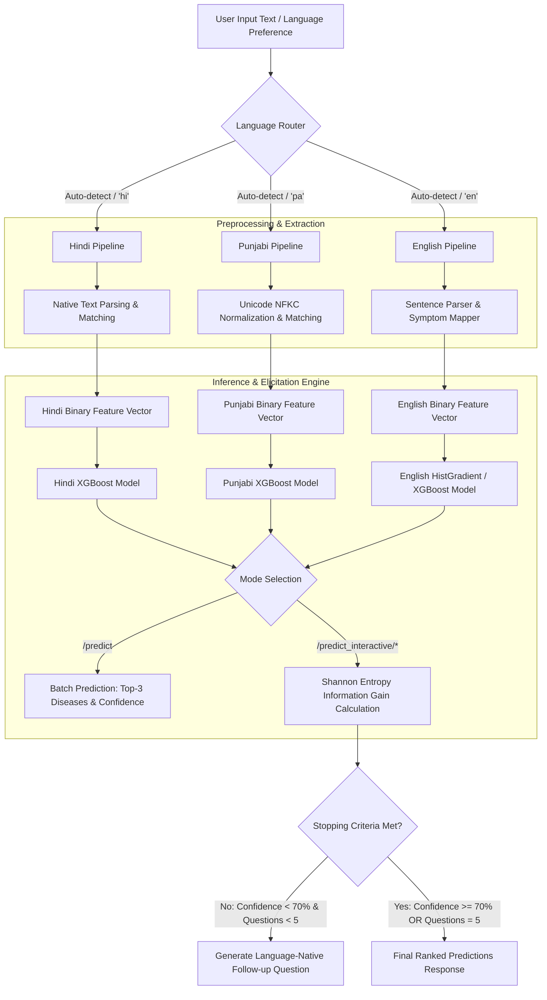

# NABHAMODEL: Multilingual Disease Prediction & Clinical Decision Support System

NABHAMODEL is a clinical decision support API designed to predict potential diseases from natural-language symptom descriptions across **English**, **Hindi (हिन्दी)**, and **Punjabi (ਪੰਜਾਬੀ)**. 

Unlike traditional healthcare platforms that rely on runtime machine translation, NABHAMODEL implements **native language machine learning models** trained directly on language-specific clinical datasets. The system features both batch prediction capabilities and an **active sequential symptom elicitation engine** based on Shannon entropy information gain to conduct interactive follow-up diagnostic questioning.

---

## Key Capabilities

- **Native Multilingual Processing**: Uses dedicated machine learning models for English, Hindi, and Punjabi rather than translating user input to English at runtime.
- **Automatic Language Detection**: Employs script and language detection (`langdetect`) to automatically route requests to the appropriate language pipeline (Devanagari script $\rightarrow$ Hindi, Gurmukhi script $\rightarrow$ Punjabi, Latin script $\rightarrow$ English).
- **Active Sequential Elicitation**: Calculates expected Shannon Information Gain across candidate symptoms to ask targeted yes/no follow-up questions, reducing question burden while improving diagnostic confidence.
- **Robust Symptom Normalization**: Combines exact string matching, curated medical synonym mapping, and RapidFuzz token-sort fuzzy matching to map colloquial user phrasing to model feature vocabularies.
- **High-Cardinality Multi-Class Classification**: Evaluates multi-class target spaces covering up to 220 disease diagnoses.
- **Clinical Validation Suite**: Evaluated against real-world reference cases from Columbia University Medical Center, WHO guidelines, and Mayo Clinic, along with noise-injection stress testing.

---

## System Architecture



### Execution Flow
1. **Request Ingestion**: The API receives free-text symptoms via `/predict` or `/predict_interactive/start`.
2. **Language Resolution**: Language is either explicitly supplied (`"en"`, `"hi"`, `"pa"`) or automatically inferred using `langdetect`.
3. **Feature Extraction**: Text is split and matched against the language-specific symptom vocabulary $M$. Fuzzy matching (`rapidfuzz`) and synonym maps (`SYNONYM_MAP`) handle spelling variations and colloquialisms.
4. **Vector Assembly**: A binary indicator vector $X \in \{0, 1\}^{1 \times M}$ is generated where $X_j = 1$ if symptom $j$ is identified, and $X_j = 0$ otherwise.
5. **Model Dispatch**: The vector is passed to the corresponding serialized model (`best_model.pkl` under `model/`, `model/hindi/`, or `model/punjabi/`).
6. **Active Elicitation (Interactive Mode)**:
   - Current class probabilities $P(Y = c \mid X)$ are evaluated to compute Shannon Entropy $H(P) = -\sum_{c} p_c \log_2 p_c$.
   - Expected Information Gain $IG(S_k) = H(P_{\text{current}}) - [0.5 H(P_{\text{yes}}) + 0.5 H(P_{\text{no}})]$ is evaluated across candidate symptoms $S_k$.
   - The symptom maximizing $IG$ is translated into a natural language question in the patient's language.

---

## Machine Learning Pipeline

### Data Preprocessing & Feature Engineering
- **Rare Disease Filtering**: Removes disease categories with fewer than 5 sample instances (`MIN_SAMPLES_PER_CLASS = 5`) to prevent severe class imbalance during stratified sampling.
- **Text Normalization**: Strips whitespace, lowercases text, and applies NFKC Unicode normalization for Gurmukhi script processing.
- **Binary Matrix Construction**: Converts comma-separated or parsed symptom lists into a binary feature matrix $X \in \{0, 1\}^{N \times M}$.
- **Label Encoding**: Encodes categorical targets into contiguous integers $y \in \{0, \dots, C-1\}$ using `scikit-learn`'s `LabelEncoder`.

### Evaluated Model Algorithms
The pipeline evaluates three tree-based ensemble architectures using 5-fold Stratified Cross-Validation (`StratifiedKFold(n_splits=5, shuffle=True, random_state=42)`):
1. **XGBoost (`xgb.XGBClassifier`)**: `n_estimators=150`, `learning_rate=0.1`, `max_depth=6`, `subsample=0.8`, `colsample_bytree=0.7`, `eval_metric="mlogloss"`.
2. **HistGradientBoosting (`HistGradientBoostingClassifier`)**: `max_iter=150`, `learning_rate=0.1`, `max_depth=6`.
3. **Random Forest (`RandomForestClassifier`)**: `n_estimators=200`, `max_depth=20`, `min_samples_split=5`, `class_weight="balanced"`.

The model achieving the highest mean cross-validation accuracy (`cv_mean`) is persisted as `best_model.pkl`.

---

## Multilingual Architecture

Each language model is trained on independent native datasets:

| Language | Dataset File | Unique Symptoms ($M$) | Target Diseases ($C$) | Primary Algorithm |
| :--- | :--- | :--- | :--- | :--- |
| **English** | `data/updated_result_with_BERT.csv` | 159 | 220 | HistGradientBoosting / XGBoost |
| **Hindi (हिन्दी)** | `data/updated_result_with_AI_HINDI.csv` | 314 | 29 | XGBoost |
| **Punjabi (ਪੰਜਾਬੀ)** | `data/updated_result_with_AI_PUNJABI.csv` | 183 | 27 | XGBoost |

---

## Project Structure

```text
.
├── app/
│   ├── main.py                     # FastAPI application entrypoint & lifespan model loader
│   ├── interactive_diagnosis.py    # Shannon entropy & information gain elicitation engine
│   ├── sentence_parser.py          # Regex pattern matcher & negation checker
│   ├── symptom_mapper.py           # RapidFuzz fuzzy matcher & synonym dictionary
│   └── templates/
│       └── interactive.html        # Jinja2 interactive UI template
├── data/
│   ├── updated_result_with_BERT.csv       # English clinical dataset
│   ├── updated_result_with_AI_HINDI.csv   # Native Hindi clinical dataset
│   └── updated_result_with_AI_PUNJABI.csv # Native Punjabi clinical dataset
├── model/                          # English model artifacts
│   ├── best_model.pkl
│   ├── label_encoder.pkl
│   ├── symptom_list.pkl
│   ├── symptom_list.json
│   ├── disease_list.json
│   ├── metadata.json
│   ├── confusion_matrix.npy
│   ├── hindi/                      # Native Hindi model artifacts
│   │   ├── best_model.pkl
│   │   ├── label_encoder.pkl
│   │   ├── symptom_list.pkl
│   │   ├── symptom_list.json
│   │   ├── disease_list.json
│   │   ├── metadata.json
│   │   └── confusion_matrix.npy
│   └── punjabi/                    # Native Punjabi model artifacts
│       ├── best_model.pkl
│       ├── label_encoder.pkl
│       ├── symptom_list.pkl
│       ├── symptom_list.json
│       ├── disease_list.json
│       ├── metadata.json
│       └── confusion_matrix.npy
├── validation/
│   ├── summary.json                # Summary of real-world validation metrics
│   ├── validation_report.png       # Generated validation accuracy charts
│   └── validation_results.csv      # Case-by-case validation outputs
├── Dockerfile                      # Container build manifest
├── requirements.txt                # Python dependency pinfile
├── train.py                        # English training pipeline
├── train_hindi.py                  # Hindi training pipeline
├── train_punjabi.py                # Punjabi training pipeline
├── validate.py                     # Clinical case validation & noise robustness suite
├── generate_results.py             # Accuracy comparison script
└── empirical_results.py            # Comprehensive visual & HTML dashboard generator
```

---

## Requirements & Setup

### Prerequisites
- Python 3.11+
- Virtual environment tool (`venv` or `conda`)

### Installation

1. Clone the repository and navigate to the project directory:
   ```bash
   git clone https://github.com/killerx1411/NABHAMODEL.git
   cd NABHAMODEL
   ```

2. Create and activate a Python virtual environment:
   ```bash
   python3 -m venv venv
   source venv/bin/activate
   ```

3. Install required dependencies:
   ```bash
   pip install -r requirements.txt
   ```

---

## Data Preparation & Training

Ensure the raw CSV datasets are located inside the `data/` directory:
- `data/updated_result_with_BERT.csv`
- `data/updated_result_with_AI_HINDI.csv`
- `data/updated_result_with_AI_PUNJABI.csv`

To train or retrain all three native models, run the training scripts in sequence:

```bash
# Train English model (outputs to model/)
python train.py

# Train Hindi model (outputs to model/hindi/)
python train_hindi.py

# Train Punjabi model (outputs to model/punjabi/)
python train_punjabi.py
```

Each training execution outputs serialized model weights (`best_model.pkl`), feature maps (`symptom_list.pkl`), target encoders (`label_encoder.pkl`), confusion matrices (`confusion_matrix.npy`), and performance summaries (`metadata.json`).

---

## Validation & Evaluation

Run the validation suite to evaluate model accuracy against clinical test cases and measure performance under noisy symptom reports:

```bash
# Execute real-world clinical validation & noise stress test
python validate.py

# Generate cross-language performance metrics
python generate_results.py

# Generate full visual and HTML empirical dashboards
python empirical_results.py
```

### Empirical Validation Summary (`validation/summary.json`)
- **Real-World Reference Cases**: 15 cases (sourced from Columbia NYPH Discharge DB, WHO guidelines, Mayo Clinic).
- **Top-1 Clinical Accuracy**: **80.0%** (12/15 cases correct on top rank).
- **Top-3 Clinical Accuracy**: **93.3%** (14/15 cases correct within top 3 ranks).
- **Noise Injection Robustness**:
  - Missing 1 symptom: **87.5%** Top-3 accuracy.
  - Missing 2 symptoms: **87.5%** Top-3 accuracy.

---

## Running the API

Start the FastAPI application server using `uvicorn`:

```bash
uvicorn app.main:app --host 0.0.0.0 --port 8000 --reload
```

Access the interactive API documentation (Swagger UI) at:
```text
http://localhost:8000/docs
```

Access the built-in interactive diagnostic web interface at:
```text
http://localhost:8000/predict_interactive/demo
```

---

## API Reference

### 1. API Health & Metadata
- **`GET /`**
  - **Description**: Returns general API operational status, version, and supported languages.
- **`GET /models`**
  - **Description**: Returns metadata for all loaded models (disease counts, symptom counts, active algorithms).

### 2. Batch Prediction
- **`POST /predict`**
  - **Description**: Predicts top-3 diseases from input text in a single request.
  - **Request Body**:
    ```json
    {
      "text": "I have high fever, severe headache, joint pain and vomiting",
      "language": "en"
    }
    ```
    *Note: `"language"` is optional. If omitted, `langdetect` automatically detects the language.*
  - **Response**:
    ```json
    {
      "predictions": [
        {
          "rank": 1,
          "disease": "Dengue",
          "confidence": 88.45,
          "confidence_label": "High"
        },
        {
          "rank": 2,
          "disease": "Malaria",
          "confidence": 8.12,
          "confidence_label": "Low"
        },
        {
          "rank": 3,
          "disease": "Typhoid",
          "confidence": 2.15,
          "confidence_label": "Low"
        }
      ],
      "detected_language": "en",
      "language_name": "English",
      "model_used": "Gradient Boosting",
      "warning": "Found 4 symptoms: high_fever, headache, joint_pain, vomiting"
    }
    ```

### 3. Interactive Diagnosis Elicitation

- **`POST /predict_interactive/start`**
  - **Description**: Initializes an active diagnostic session.
  - **Request Body**:
    ```json
    {
      "text": "मुझे बुखार और सिरदर्द है",
      "language": "hi"
    }
    ```
  - **Response**:
    ```json
    {
      "session_id": "3f2504e0-9b3b-4b2a-89a1-7c9811f5d6a2",
      "current_predictions": [
        { "rank": 1, "disease": "Typhoid", "confidence": 42.10 },
        { "rank": 2, "disease": "Malaria", "confidence": 35.80 },
        { "rank": 3, "disease": "Common Cold", "confidence": 12.30 }
      ],
      "next_question": {
        "symptom": "vomiting",
        "question": "क्या आपको उल्टी हो रहा है?",
        "information_gain": 0.3421
      },
      "status": "questioning",
      "language": "hi"
    }
    ```

- **`POST /predict_interactive/answer`**
  - **Description**: Submits a yes/no response to a follow-up question.
  - **Request Body**:
    ```json
    {
      "session_id": "3f2504e0-9b3b-4b2a-89a1-7c9811f5d6a2",
      "symptom": "vomiting",
      "answer": true
    }
    ```
  - **Response**: Returns updated top-3 predictions and the next question, or sets `"status": "complete"` if confidence exceeds 70% or 5 questions have been answered.

- **`POST /predict_interactive/add_text`**
  - **Description**: Appends additional free-text symptoms to an ongoing active session without clearing previous responses.
  - **Request Body**:
    ```json
    {
      "session_id": "3f2504e0-9b3b-4b2a-89a1-7c9811f5d6a2",
      "text": "ਮੈਨੂੰ ਠੰਢ ਵੀ ਲੱਗ ਰਹੀ ਹੈ"
    }
    ```

---

## Docker Deployment

To build and run the application container using Docker:

1. Build the Docker image:
   ```bash
   docker build -t nabhamodel .
   ```

2. Run the container on port 8000:
   ```bash
   docker run -p 8000:8000 nabhamodel
   ```

3. Test the containerized API:
   ```bash
   curl http://localhost:8000/
   ```

---

## Technical Limitations & Implementation Notes

- **In-Memory Session Persistence**: The interactive session store (`SESSIONS` dictionary in `app/interactive_diagnosis.py`) is held in server memory. Production deployments requiring multi-worker load balancing should back session state with Redis or MongoDB.
- **Minimum Class Instances**: Diseases with fewer than 5 records in the training datasets are filtered out (`MIN_SAMPLES_PER_CLASS = 5`).
- **Clinical Decision Support Scope**: This software provides statistical inference for diagnostic assistance and is not intended to serve as a standalone autonomous medical diagnostic device.
